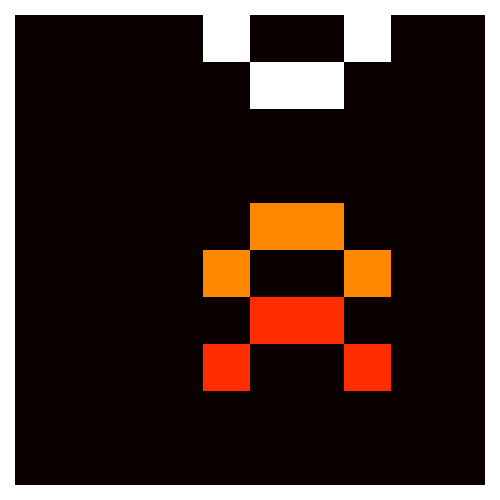

# QRITTERS
An investigation of critters in a quantum world

## What is Qritters?
Qritters is a simulation of a tiny virtual world which obeys the rules of quantum mechanics, much like the world we live in. 

It starts with a cellular automaton called [Critters](https://en.wikipedia.org/wiki/Critters_(cellular_automaton)). The world of Critters is made up of cells which can be either `ON` or `OFF`, along with a reversible rule for updating the state of each cell as time moves forward. The seemingly simple rules of Critters result in interesting behavior, including the emergence of small entities, like the "glider" shown below.

These gliders can then be "scattered" off of one another:

A | B
:- | :- 
 | 

Noting that this sort of scattering is not unlike the quantum [particle scattering experiments](https://en.wikipedia.org/wiki/Scattering) used to test the [Standard Model](https://en.wikipedia.org/wiki/Standard_Model) of particle physics, one can ask whether we can do quantum scattering with these gliders as well.

Qritters does exactly this, by "quantizing" the classical Critters automaton, and implementing it on a (simulated) quantum computer. The model is simple, but it allows for the simulation of a scattering event between two gliders - one of which is in a quantum superposition. This results in the two gliders being entangled at the end of the experiment.

 

In other words this is a simulation of the generation of quantum entanglement between emergent virtual creatures.

## What's in this repository?
The first notebook, [I_Intro_to_CA.ipynb](I_Intro_to_CA.ipynb), contains an introduction to cellular automata. As an example, it implements Conway's [Game of Life](https://en.wikipedia.org/wiki/Conway%27s_Game_of_Life) automaton in Python.

The second notebook, [II_Reversible_CA.ipynb](II_Reversible_CA.ipynb), describes the classical automaton Critters, and implements it in Python.

The third notebook, [III_Quantum_CA.ipynb](III_Quantum_CA.ipynb), then defines our simple "quantized" version of Critters ("Qritters"). The implementation of Qritters as a simulated quantum circuit is given here, using Python and [Qiskit](https://qiskit.org). The quantum glider scattering is carried out, and we show some evidence that the gliders are entangled with one another.

## What's next for Qritters?
Right now the next thing on the to-do list (in addition to cleaning up some of the existing code) is to explore more rigorous methods of witnessing entanglement between gliders. This will also involve considering more interesting initial conditions.